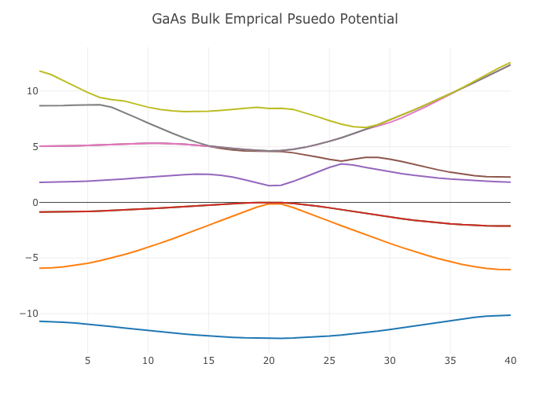

# EmpiricalPseudopotential

# EmpiricalPseudopotential.jl

This repo aims to calculate band structure for semiconductor by using empirical pseudo potential 

# Reference

### Pseudo potential
> [浜口智尋, "半導体物理", 朝倉書店, 2001](https://www.asakura.co.jp/books/isbn/978-4-254-22145-9/)

### Band Parameter
> [I. Vurgaftman, J.R. Meyer and L.R. Ram-Mohan, J. Appl. Phys.,89, 5815(2001).](https://aip.scitation.org/doi/pdf/10.1063/1.1368156?class=pdf)