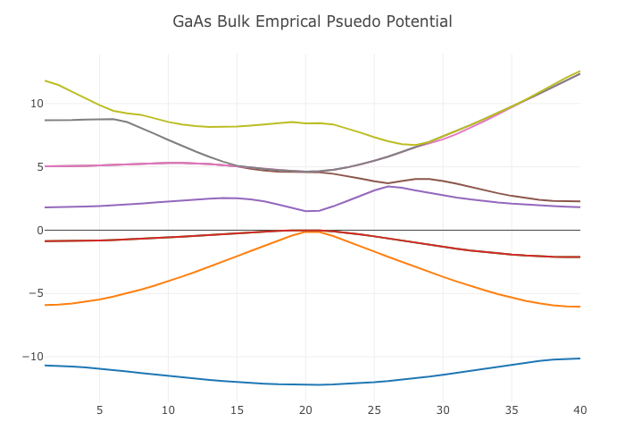

# EmpiricalPseudopotential

[](https://travis-ci.com/funabashi800/EmpiricalPseudopotential.jl)
[](https://codecov.io/gh/funabashi800/EmpiricalPseudopotential.jl)
# EmpiricalPseudopotential.jl

This repo aims to calculate band structure for semiconductor by using empirical pseudo potential 



# Installation
```julia
using Pkg
Pkg.add(https://github.com/funabashi800/EmpiricalPseudopotential.jl.git)
```

# Usage

## Bulk
```julia
# Define material
InSb = p.Material("InSb", "fcc")

# Calculate pseudo potential
E = p.EigenEnergy(InSb)

# Plot band structure
p.BandStructure(E, fielname="InSb")

# Calculate band gap
p.BandGap(E
```

## Strain effect(Biaxial strain)
```julia
# Define material
InSb = p.Material("InSb", "fcc")
# calculate strained lattice constant
# e.g. strain(Material, percent=0.1%) or strain(Material, by=6.379e-10)
p.strain(InSb, percent=0.5)

# Calculate pseudo potential
E = p.EigenEnergy(InSb)

# Plot band structure
p.BandStructure(E, fielname="InSb")

# Calculate band gap
p.BandGap(E)
```

## Ternary Material
```julia
# Define materials
InSb = p.Material("InSb", "fcc")
GaSb = p.Material("GaSb", "fcc")

# Generate ternary material from above two materials with each alloy
InGaSb = p.mix("InGaSb", InSb, 0.4, GaSb, 0.6)

# Calculate pseudo potential
E = p.EigenEnergy(InGaSb)

# Plot band structure
p.BandStructure(E, fielname="InGaSb")

# Calculate band gap
p.BandGap(E)
```

# Reference

### Pseudo potential
> [浜口智尋, "半導体物理", 朝倉書店, 2001](https://www.asakura.co.jp/books/isbn/978-4-254-22145-9/)

### Band Parameter
> [I. Vurgaftman, J.R. Meyer and L.R. Ram-Mohan, J. Appl. Phys.,89, 5815(2001).](https://aip.scitation.org/doi/pdf/10.1063/1.1368156?class=pdf)
